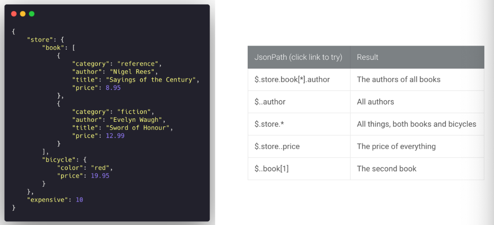

# 1단계 - 지하철역 인수 테스트 작성

## 기능 요구사항

* RestAssured를 활용
* 지하철역 관련 인수 테스트 완성
    * 지하철역 목록 조회
    * 지하철역 삭제

## 인수 조건 및 시나리오

```
# 지하철역을 생성한다

When 지하철역을 생성하면
Then 지하철역이 생성된다
Then 지하철역 목록 조회 시 생성한 역을 찾을 수 있다
```

```
# 기존에 존재하는 지하철역 이름으로 지하철역을 생성한다

Given 지하철역을 생성하고
When  기존에 존재하는 지하철역 이름으로 지하철역을 생성하면
Then  지하철역 생성이 안된다
```

```
# 지하철역을 조회한다

Given 2개의 지하철역을 생성하고
When  지하철역 목록을 조회하면
Then  2개의 지하철역을 응답 받는다
```

```
# 지하철역을 제거한다

Given 지하철역을 생성하고
When  그 지하철역을 삭제하면
Then  그 지하철역 목록 조회 시 생성한 역을 찾을 수 없다
```

## API 명세

### 지하철역 목록

### HTTP request

```
GET /stations HTTP/1.1
Accept: application/json
Host: localhost:8080
```

### HTTP response

```
HTTP/1.1 200 OK
Vary: Origin
Vary: Access-Control-Request-Method
Vary: Access-Control-Request-Headers
Content-Type: application/json
Content-Length: 167 
 
[ {
    "id" : 1,
    "name" : "지하철역이름"
}, {
    "id" : 2,
    "name" : "새로운지하철역이름"
}, {
    "id" : 3,
    "name" : "또다른지하철역이름"
} ]
```

## 지하철역 삭제

### HTTP request

``` 
DELETE /stations/1 HTTP/1.1
Host: localhost:8080
```

### HTTP response

```
HTTP/1.1 204 OK
Vary: Origin
Vary: Access-Control-Request-Method
Vary: Access-Control-Request-Headers
```

### 인수 테스트 리펙터링 힌트

* **JsonPath**
    * Json 문서를 읽어오는 DSL
    * JsonPath를 사용하면 Response Dto 객체로 받을 필요 없이 값만 추출할 수 있음
      